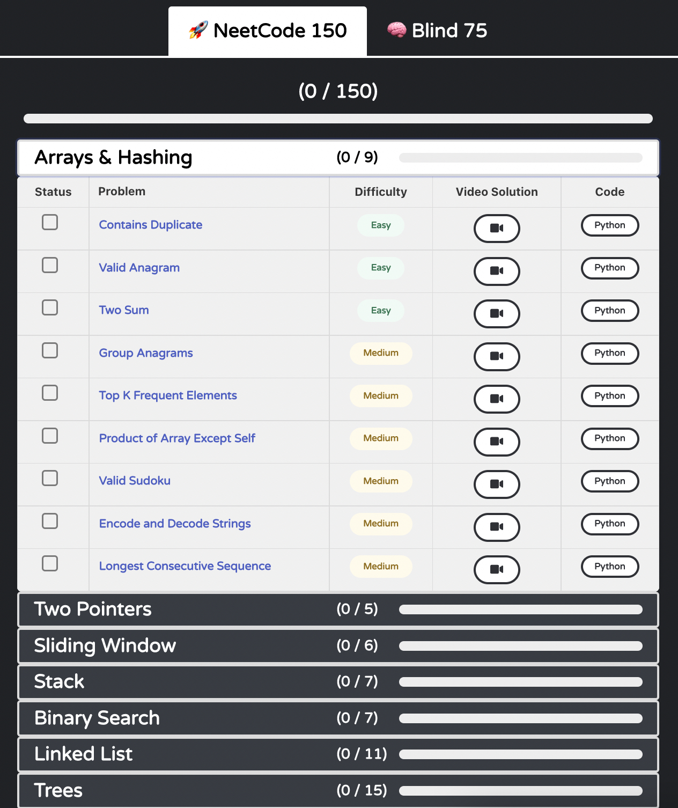

**I turned this guide into a website! Please visit [https://interviewguide.dev/leetcode](https://interviewguide.dev/leetcode) to see the latest version.**

# Leetcode-Style Interviews

Note: If you enjoy this write-up, please star the repo and/or share with colleagues. I'll be writing my advice on other types of interviews (e.g., behavioral, practical coding, tech knowledge, and system design) in this repo as well!

## What are Leetcode-style interviews?

Leetcode-style interviews are probably the most infamous type of software development interview out there. In these interviews, you're given an algorithm/data structure challenge that you have to solve either on a whiteboard or computer. The interviewer is judging your coding, critical thinking, communication, and problem solving skills. Often, you're expected to communicate decisions and tradeoffs you're making and discuss the time and space complexity of your solution.

While many companies (especially big tech companies) conduct Leetcode-style interviews, it's important to recognize that many other companies _don't_ perform these kinds of interviews. [This Github repo](https://github.com/poteto/hiring-without-whiteboards) has a list of companies that don't perform Leetcode-style interviews. Additionally, if you're interested in a company and are curious as to whether they do Leetcode-style interviews, be sure to check out the interview section of their [Glassdoor](https://glassdoor.com) page. If you're really uncomfortable with the idea of algorithm and data structure challenges, you can definitely find great jobs where you don't have to solve these puzzles.

## How you're evaluated

It's common to panic and think "I must find the optimal solution" when facing a Leetcode-style problem. In my experience, this isn't the case. I had one FAANG interview where I think I provided the optimal solution for maybe one out of the four Leetcode-style problems but _still_ got the job offer.

While it's impossible to generalize this _too_ much (companies vary), you're usually assessed on the following topics:

- **Coding ability.** Do you have a good grasp of control flow and logic? Can you write code relatively quickly and is it well-formated? Do you name variables logically?
- **Algorithms/data structures.** Do you use algorithms and data structures appropriately? How optimal was the space and time complexity of your solution? Did you correctly assess the space and time complexity?
- **Communication.** Did you explain your work well? Did you ask clarifying questions? Did you talk about tradeoffs? Can you explain technical concepts? Were you closed off or rude?
- **Problem solving skills.** Did you take time to understand the question and ask the right clarifying questions? Did you give the interviewer the impression that you'd be rigorous in approaching new challenges?

As you can see, the algorithms and data structure part is just a small piece of the puzzle. At least for me, this was a big load off my mind: of course you should try to do your best to come up with an optimal solution, but you can get pretty far by honing your skill in some of these other areas.

## How to prepare for Leetcode-style interviews

My first suggestion is to purchase a [Leetcode](https://leetcode.com) premium membership. This can be a controversial opinion, but I truly think the added features justify the $35/month. The two biggest benefits to me are:

- Official Leetcode-provided solutions
- Company tags for questions, sortable by frequency

**Note:** If $35/month will put you in a bad position financially, don't buy it! You can find the same information for free, but it just takes a bit more time to seek it out. For example, there are some good solutions to various problems on YouTube. Additionally, you can find company-specific questions in the Leetcode forums.

### Using the NeetCode 150

Leetcode is a huge site with thousands of questions. So where to begin? Enter _Neetcode_.

[NeetCode](https://neetcode.io) really saved my bacon when it comes to Leetcode-style interviews. NeetCode provides a list of 150 curated, categorized problems to practice. In addition to curating a list of problems, the author has created _excellent_ video solutions for each problem.

The following screenshot shows the NeetCode user interface.

The process I recommend for using NeetCode 150 is as follows:

1. Do all of the "easy" problems in one category. This helps you learn the fundamental data structures and algorithms associated with this category of problem.
2. Repeat this for each category, going down the list.
3. Once you've done all the "easy" problems, repeat the process for the "medium" problems. This will check how well you retained some of those core data structures and algorithms and be a good bit more challenging.
4. Finally, repeat for the "hard" problems. These are mostly going to be quite tough!

As you do each problem, make sure to try to assess the space and time complexity of your solution. [The Big O Cheatsheet](https://www.bigocheatsheet.com/) can be a handy reference when you're trying to figure out complexity.

### When you're stuck

For each problem, I recommend trying to solve the problem on your own for at least 30 minutes. If it's a "hard" problem, go for 45 minutes to an hour.

Inevitably, you'll get stuck. In fact, if you haven't done a lot of Leetcoding, you'll probably get stuck on "easy" problems (I certainly did). What helped me the most is the NeetCode tutorial video associated with each problem. They're very well done, usually whiteboarding the theory behind the solution before writing the actual code. The official Leetcode-provided solutions can also be a big help: they typically start with a "brute force" solution and then work up to smarter and smarter solutions with improved space and time complexity.

Once you understand the approaches, go back to LeetCode and write the solution yourself without the video. This was extremely important to me&mdash;watching a video of the solution and actually writing that solution out are very different things.

### Do all the problems if you can

Do all the NeetCode 150 problems if you can. I actually couldn't&mdash;there were some "hard" problems for which I never got a functioning solution. Oh well!

### Company-tagged questions

Users can report to Leetcode when they see a question at a certain company. Leetcode tags questions with these companies and computes the most-frequently reported questions per company. If you subscribe to Leetcode Premium, you'll have access to this feature. Many companies actively avoid asking questions that have leaked onto Leetcode; however, I still found practicing these tagged questions to be fruitful because it gives you a flavor for the types of questions certain companies ask.

My recommendation is to navigate to a company's tagged questions (assuming you'll be interviewing with that company) and sort by frequency so you can complete the most frequent questions at that company.

### Practice talking through solutions

It's going to feel strange at first, but it's really good practice to describe what you're thinking and doing as you solve practice problems. You don't want the interview to be the first time you do this!

### Use Glassdoor

Use [Glassdoor](https://glassdoor.com) to look at a company's interview page. Often, people will write about the kinds of questions they're asked. You may find they focus on a specific category of Leetcode problem (or maybe they don't even ask Leetcode-style questions).

### Use whatever language you know best

There are a lot of takes on what the best language is for Leetcoding (hint: it's Python). But the truth is you should just use whatever language you're most comfortable with. I have had a front-end focus most of my career, so I used JavaScript. If you have no best language, then use Python (it's terse, readable, and has some nice built-in data structures).

It's unlikely a company will require you to use a certain language, but I _have_ heard of it happening. Make sure to check in with your recruiter to verify you can use your chosen language!

## How much Leetcode practicing is enough?

This is a very hard question to answer! I did somewhere around 220 total questions last time around and had a lot of success during my interviews. That being said, some people do well practicing less and some people don't do well practicing more.

There are a couple of realities here:

- Quality of your practicing is more important than quantity. If you complete a ton of questions but only because you look at the answer every time, you're not really developing your problem-solving skills.
- There's a good bit of luck when you're interviewing. Practicing more problems increases the likelihood that you'll have success in an interview, but there's always a decent chance even the most practiced person will be stumped.

The truth is I never felt truly ready to interview for Leetcode-style questions, but I did a couple hundred questions and just went for it.

## Hone your soft skills

I've talked a lot about solving Leetcode problems, but in reality there's another piece of the Leetcode-style interview process that's comparably important: you should aim to leave the interviewer thinking, "wow, I'd love to work with that person."

I (think) I have had success in this area by doing the following:

- **Overcommunicate.** The interviewer has no way of knowing what you're thinking unless you tell them. This is especially important if you haven't figured out a solution yet and you're thinking through options.
- **Be friendly.** Leetcode-style interviews are stressful. By default, when we're stressed, we are not very happy. Interviewers see _a lot_ of candidates who are all business trying to crank away at these coding challenges. You can stand out a lot if you smile and are conversational/friendly.
- **Ask questions checking your logic.** Interviewers mostly want you to succeed, especially if you seem like a good person. My favorite question to ask during a Leetcode-style interview is, "does that make sense?" I'll use this after I have proposed an approach to the problem and explained its time and space complexity. If you're on the money, the interviewer will often say, "yeah, that sounds great to me!" If they want to see something different (e.g., there's a flaw in your logic or your solution won't be efficient enough for them), they'll often tell you that. That's a huge benefit to prevent you going down the wrong path!

You can't necessarily control whether you get a Leetcode problem you'll be able to solve optimally, but you _can_ control your demeanor/soft skills during the interview. This could be the difference between getting the job and not getting the job!

## Recap

This was a long section, so I'd like to provide a recap.

1. Practice Leetcode-style questions by using the [NeetCode 150](https://neetcode.io/practice). Do all the easy questions, then the medium questions, then the hard questions. Spend at least 30-60 minutes trying to figure out each question yourself before watching the NeetCode walkthrough video.
2. Practice talking through questions as you solve them.
3. Use Leetcode company tags to find the most-frequently asked questions at a company.
4. Use [Glassdoor](https://glassdoor.com) to see what types of questions are asked at a company.
5. Don't develop tunnel-vision on just solving the problem. Make sure you focus on coming off as a good potential colleague.
